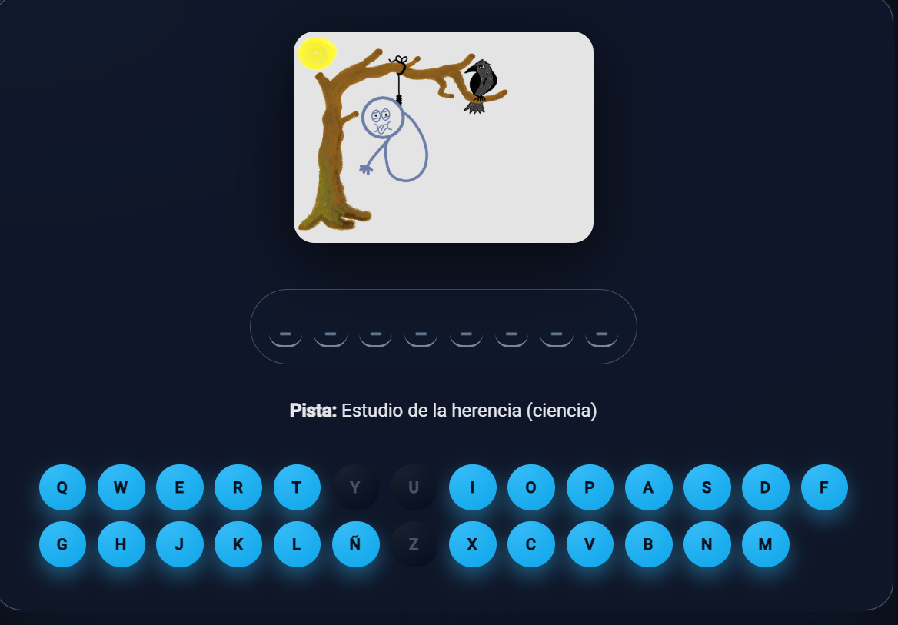
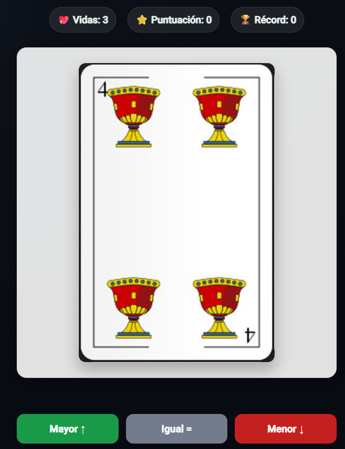
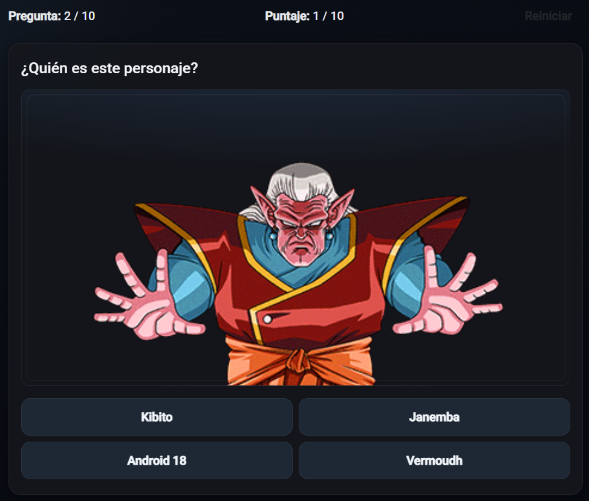
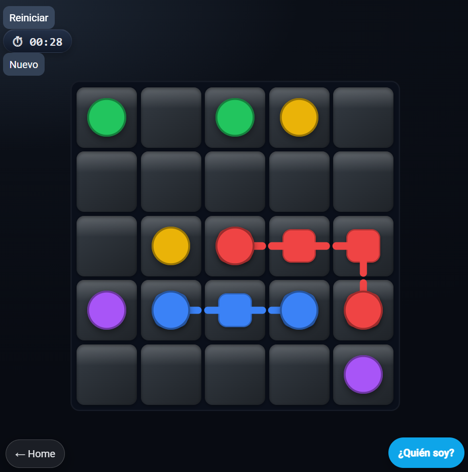

# Arcade Room — Interactive Gaming Platform

A full-stack single-page application where registered users play a collection of mini-games, track their performance, and chat in real time. Built with Angular and Supabase, featuring authentication, real-time data, protected routes, and per-player statistics.

**🔗 Live demo:** https://sala-de-juegos-2025.web.app/

<!-- OPTIONAL: a hero screenshot of the home screen looks great here. Drop it in src/assets/presentacion/ and uncomment the line below -->
<!--  -->

---

## Features

- **Authentication** — user registration and login handled through Supabase Auth, with automatic session management. Login and register buttons are hidden once the user is authenticated.
- **Access logging** — every login attempt (successful or failed) is recorded in the database, along with the component, action, and user agent.
- **Real-time chat** — logged-in users can join a shared chat room powered by Supabase Realtime; each message is tagged with the sender and the time it was sent.
- **Protected routes** — route protection with Angular `CanActivate` guards, including an admin-only guard that checks the user's role in the database.
- **Per-player statistics** — every game result (user, date, score) is stored in Postgres and listed in a dedicated results section, with an admin view across all players.
- **User survey** — a reactive form with validation (age 18–99, phone number format, multiple control types) whose answers are saved to the database.
- **Modular architecture** — feature modules loaded on demand via lazy loading (`loadChildren`) to keep initial load times low.

## Games

| Game | Description |
|------|-------------|
| **Hangman** | Classic word-guessing game. Letters are entered through on-screen buttons (no keyboard input). |
| **Higher or Lower** | The player predicts whether the next card from the deck is higher or lower, scoring a point for each correct guess. |
| **Trivia (Preguntados)** | Image-based trivia. Images are fetched from an external API through an injectable Angular service; the player answers via multiple choice. |
| **Flow Free** (own game) | Connect matching colored dots by drawing paths across the grid. Paths cannot cross, and the puzzle is solved when every pair is connected and the whole board is filled. |

## Screenshots

### Hangman


### Higher or Lower


### Trivia


### Flow Free


## Tech Stack

- **Frontend:** Angular, TypeScript, RxJS
- **Backend / Database:** Supabase (Auth + Postgres + Realtime)
- **UI:** Angular Material / PrimeNG / Bootstrap, CSS animations
- **Hosting:** Firebase Hosting

## Architecture Highlights

- Lazy-loaded feature modules to reduce the initial bundle size.
- External REST API consumption isolated in injectable services.
- Route protection through `CanActivate` guards, with a separate admin guard that verifies roles against the database.
- Reactive forms with custom validation for the user survey.
- Real-time messaging via Supabase channels (`postgres_changes` + broadcast for typing indicators).
- No native `alert()` — all user feedback is handled through in-app UI components.

## Getting Started

```bash
# Clone the repository
git clone https://github.com/nachomonllor/sala-de-juegos-2025.git
cd sala-de-juegos-2025

# Install dependencies
npm install

# Run the development server
ng serve
```

Then open `http://localhost:4200/` in your browser.

> **Note:** This project uses Supabase. To run it with your own backend, create a Supabase project and add your URL and anon key to the environment files (`src/environments/`).

## About

Built as a full-stack learning project to practice Angular architecture, real-time data, authentication flows, and reactive forms. Part of my developer portfolio — see more at [github.com/nachomonllor](https://github.com/nachomonllor).
